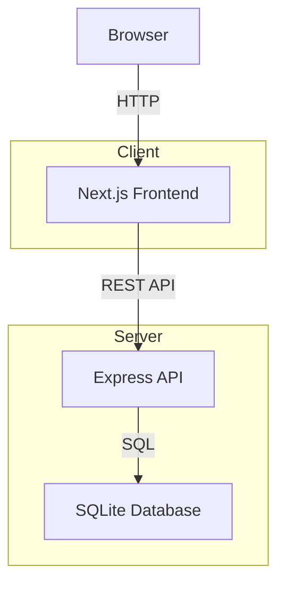

# Mini Compliance Tracker

Simple web app to track compliance tasks for clients.

## Features
- Client list
- Tasks per client with add/update/filter/search/sort
- Overdue task highlighting
- Summary stats (total, pending, overdue)
- Persistent storage (SQLite)

## Local Setup
1. Ensure Node.js >= 18.17.0
2. Backend: `cd server && npm install && npm start` (port 3001)
3. Frontend: `cd client && npm install && npm run dev` (port 3000)
4. Or root: `npm install && npm run dev`

## Docker Setup
1. Ensure Docker and Docker Compose installed
2. `docker-compose up --build`
3. Access at http://localhost:3000

## Deployment
- Frontend: [Vercel link TBD]
- Backend: [Render link TBD]

For backend on Render, set environment variable: `CORS_ORIGIN=https://your-frontend.vercel.app`

For frontend on Vercel, set: `NEXT_PUBLIC_API_URL=https://your-backend.onrender.com/api`

## API
- GET /api/clients
- GET /api/tasks/:clientId
- POST /api/tasks
- PATCH /api/tasks/:id/status

## Tech Stack
- Frontend: Next.js, React, Tailwind CSS
- Backend: Node.js, Express
- Database: SQLite (via better-sqlite3 / knex optional)
- Authentication: None (internal use)
- Containerization: Docker + Docker Compose
- Testing: (not implemented yet)

## System Architecture

Built with Next.js (frontend), Express + SQLite (backend).

## Tradeoffs
- Used SQLite for simplicity, in production use PostgreSQL.
- Basic UI with Tailwind, focused on functionality.
- No auth, assuming internal use.

## Assumptions
- Single user, no concurrency issues.
- Dates in YYYY-MM-DD format.
